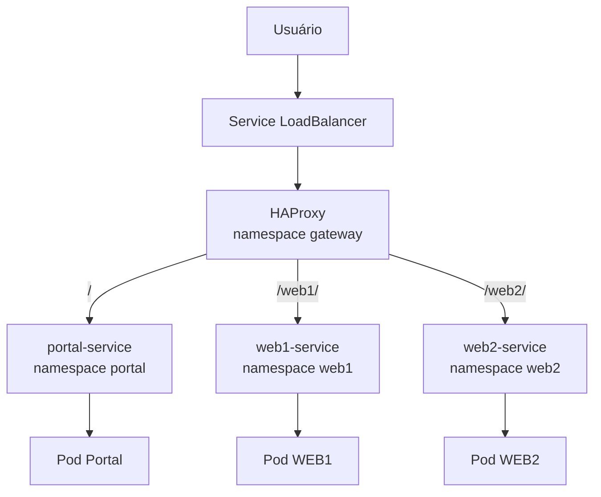

# POC — Portal + HAProxy + Namespaces no GKE

## 1. Objetivo

Esta POC demonstra uma arquitetura Kubernetes em que:

- existe um **portal web central**;
- cada aplicação possui seu **próprio namespace**;
- cada aplicação possui seus próprios Pods, Deployments, Services e ConfigMaps;
- um **HAProxy central** atua como gateway HTTP;
- o HAProxy acessa aplicações que estão em namespaces diferentes;
- os Services internos permanecem do tipo `ClusterIP`;
- somente o HAProxy é exposto externamente;
- a implantação é feita por **Jenkins Pipeline**;
- o cluster de destino é um **Google Kubernetes Engine (GKE)**.

A POC utiliza duas aplicações de exemplo:

- `web1`
- `web2`

e um portal com links para ambas.

---

## 2. Conceito principal

O ponto central da arquitetura é:

> O HAProxy não acessa diretamente os Pods. Ele encaminha as requisições para os Services Kubernetes.

Isso é importante porque Pods são efêmeros:

- podem ser recriados;
- podem mudar de IP;
- podem aumentar ou diminuir em quantidade;
- podem ser substituídos durante um rollout.

O Service oferece um endereço estável para os Pods.

Exemplo:

```text
web1-service.web1.svc.cluster.local
```

Esse endereço significa:

```text
Service:    web1-service
Namespace:  web1
Domínio:    svc.cluster.local
```

Assim, mesmo estando no namespace `gateway`, o HAProxy consegue acessar um Service no namespace `web1`.

---

## 3. Arquitetura da POC



Outra visão:

```text
                         INTERNET
                            |
                            v
                  Service LoadBalancer
                            |
                            v
                 +--------------------+
                 |      HAProxy       |
                 | namespace gateway  |
                 +---------+----------+
                           |
             +-------------+-------------+
             |             |             |
             v             v             v
          Portal          WEB1          WEB2
         ClusterIP       ClusterIP     ClusterIP
             |             |             |
             v             v             v
           Pod           Pod           Pod
        namespace      namespace     namespace
         portal          web1          web2
```

---

## 4. Namespaces utilizados

A POC cria quatro namespaces:

| Namespace | Função |
|---|---|
| `gateway` | HAProxy e Service LoadBalancer |
| `portal` | Portal web |
| `web1` | Aplicação WEB1 |
| `web2` | Aplicação WEB2 |

Separar as aplicações por namespace facilita:

- organização;
- políticas de rede;
- RBAC;
- quotas;
- troubleshooting;
- observabilidade;
- automação;
- isolamento lógico.

---

## 5. Objetos Kubernetes criados

### Namespace `gateway`

- `Deployment/haproxy`
- `Service/haproxy-service`
- `ConfigMap/haproxy-config`

### Namespace `portal`

- `Deployment/portal`
- `Service/portal-service`
- `ConfigMap/portal-html`

### Namespace `web1`

- `Deployment/web1`
- `Service/web1-service`
- `ConfigMap/web1-html`

### Namespace `web2`

- `Deployment/web2`
- `Service/web2-service`
- `ConfigMap/web2-html`

Opcionalmente:

- `NetworkPolicy` em `portal`
- `NetworkPolicy` em `web1`
- `NetworkPolicy` em `web2`

---

## 6. Fluxo HTTP

O usuário acessa o endereço externo criado pelo GKE.

Exemplo:

```text
http://34.120.10.20/
```

O HAProxy decide o destino usando o path.

### Portal

```text
GET /
```

Fluxo:

```text
Browser
   |
   v
HAProxy
   |
   v
portal-service.portal.svc.cluster.local
   |
   v
Portal Pod
```

### WEB1

```text
GET /web1/
```

Fluxo:

```text
Browser
   |
   v
HAProxy
   |
   | remove /web1
   v
GET /
   |
   v
web1-service.web1.svc.cluster.local
   |
   v
WEB1 Pod
```

### WEB2

```text
GET /web2/
```

Fluxo:

```text
Browser
   |
   v
HAProxy
   |
   | remove /web2
   v
GET /
   |
   v
web2-service.web2.svc.cluster.local
   |
   v
WEB2 Pod
```

---

## 7. DNS entre namespaces

O Kubernetes fornece resolução DNS interna.

Formato:

```text
<service>.<namespace>.svc.cluster.local
```

Nesta POC:

```text
portal-service.portal.svc.cluster.local
web1-service.web1.svc.cluster.local
web2-service.web2.svc.cluster.local
```

O HAProxy utiliza esses nomes diretamente.

Exemplo:

```haproxy
server web1 web1-service.web1.svc.cluster.local:80 check
```

Isso significa que o HAProxy não precisa conhecer:

- IP dos Pods;
- quantidade de Pods;
- Node onde o Pod está;
- IP temporário do container.

---

## 8. Roteamento do HAProxy

A configuração base utilizada é:

```haproxy
global
    log stdout format raw local0
    maxconn 2000

defaults
    log global
    mode http

    option httplog
    option dontlognull

    timeout connect 5s
    timeout client 30s
    timeout server 30s

frontend http_front

    bind *:8080

    acl route_web1 path_reg ^/web1(/|$)
    acl route_web2 path_reg ^/web2(/|$)

    use_backend backend_web1 if route_web1
    use_backend backend_web2 if route_web2

    default_backend backend_portal

backend backend_portal

    balance roundrobin

    server portal portal-service.portal.svc.cluster.local:80 check

backend backend_web1

    balance roundrobin

    http-request replace-path ^/web1/?(.*)$ /\1

    server web1 web1-service.web1.svc.cluster.local:80 check

backend backend_web2

    balance roundrobin

    http-request replace-path ^/web2/?(.*)$ /\1

    server web2 web2-service.web2.svc.cluster.local:80 check
```

---

## 9. Por que utilizar `replace-path`

Externamente o usuário acessa:

```text
/web1/
```

Mas o nginx da aplicação espera:

```text
/
```

Então:

```haproxy
http-request replace-path ^/web1/?(.*)$ /\1
```

transforma:

```text
/web1/
```

em:

```text
/
```

Também funciona para caminhos internos.

Exemplo:

```text
/web1/images/logo.png
```

vira:

```text
/images/logo.png
```

---

## 10. Service do HAProxy no GKE

O HAProxy é publicado usando:

```yaml
type: LoadBalancer
```

Exemplo:

```yaml
apiVersion: v1
kind: Service

metadata:
  name: haproxy-service
  namespace: gateway

spec:

  selector:
    app: haproxy

  ports:

    - name: http
      port: 80
      targetPort: 8080

  type: LoadBalancer
```

No GKE, esse Service provisiona um Load Balancer externo.

Depois da implantação:

```bash
kubectl get svc haproxy-service -n gateway
```

Exemplo de saída:

```text
NAME              TYPE           CLUSTER-IP     EXTERNAL-IP      PORT(S)
haproxy-service   LoadBalancer   10.32.15.10    34.120.10.20     80:xxxx/TCP
```

A aplicação poderá ser acessada por:

```text
http://34.120.10.20/
http://34.120.10.20/web1/
http://34.120.10.20/web2/
```

---

## 11. Estrutura sugerida do repositório

```text
k8s-haproxy-poc/
│
├── Jenkinsfile
├── README.md
│
└── k8s-poc/
    ├── 00-namespaces.yaml
    ├── 10-portal.yaml
    ├── 20-web1.yaml
    ├── 30-web2.yaml
    ├── 40-haproxy.yaml
    └── 50-networkpolicy.yaml
```

Na pipeline desta POC os manifests são gerados dinamicamente no workspace.

Em uma evolução futura, eles podem passar a ser versionados no repositório.

---

# 12. Jenkinsfile

A pipeline abaixo:

1. valida o acesso ao GKE;
2. prepara o workspace;
3. gera os manifests;
4. valida os YAMLs;
5. cria os namespaces;
6. implanta portal;
7. implanta WEB1;
8. implanta WEB2;
9. aguarda os rollouts;
10. implanta HAProxy;
11. aplica NetworkPolicy opcionalmente;
12. executa testes internos;
13. mostra o IP externo.

```groovy
pipeline {

    agent any

    options {
        disableConcurrentBuilds()
    }

    parameters {

        booleanParam(
            name: 'APPLY_NETWORK_POLICY',
            defaultValue: false,
            description: 'Aplicar NetworkPolicy restringindo o acesso às aplicações somente ao namespace gateway'
        )
    }

    environment {
        MANIFEST_DIR = 'k8s-poc'
    }

    stages {

        stage('Validar acesso ao GKE') {

            steps {

                sh '''
                    set -e

                    echo "============================================"
                    echo "Contexto atual do kubectl"
                    echo "============================================"

                    kubectl config current-context

                    echo
                    echo "============================================"
                    echo "Cluster"
                    echo "============================================"

                    kubectl cluster-info

                    echo
                    echo "============================================"
                    echo "Nodes"
                    echo "============================================"

                    kubectl get nodes -o wide
                '''
            }
        }

        stage('Preparar manifests') {

            steps {

                sh '''
                    rm -rf "$MANIFEST_DIR"
                    mkdir -p "$MANIFEST_DIR"
                '''
            }
        }

        stage('Gerar Namespaces') {

            steps {

                writeFile(
                    file: "${env.MANIFEST_DIR}/00-namespaces.yaml",
                    text: '''
apiVersion: v1
kind: Namespace
metadata:
  name: gateway

---
apiVersion: v1
kind: Namespace
metadata:
  name: portal

---
apiVersion: v1
kind: Namespace
metadata:
  name: web1

---
apiVersion: v1
kind: Namespace
metadata:
  name: web2
'''
                )
            }
        }

        stage('Gerar Portal') {

            steps {

                writeFile(
                    file: "${env.MANIFEST_DIR}/10-portal.yaml",
                    text: '''
apiVersion: v1
kind: ConfigMap

metadata:
  name: portal-html
  namespace: portal

data:

  index.html: |
    <!DOCTYPE html>

    <html lang="pt-BR">

    <head>

        <meta charset="UTF-8">

        <title>Portal Kubernetes</title>

        <style>

            body {
                font-family: Arial, sans-serif;
                background: #1e293b;
                color: white;
                text-align: center;
                padding-top: 100px;
            }

            h1 {
                margin-bottom: 40px;
            }

            .apps {
                display: flex;
                justify-content: center;
                gap: 30px;
            }

            .app {
                padding: 30px 60px;
                background: #334155;
                border-radius: 10px;
                text-decoration: none;
                color: white;
                font-size: 24px;
            }

            .app:hover {
                background: #475569;
            }

        </style>

    </head>

    <body>

        <h1>Portal de Aplicações</h1>

        <div class="apps">

            <a class="app" href="/web1/">
                WEB 1
            </a>

            <a class="app" href="/web2/">
                WEB 2
            </a>

        </div>

    </body>

    </html>


---
apiVersion: apps/v1
kind: Deployment

metadata:
  name: portal
  namespace: portal

spec:

  replicas: 1

  selector:

    matchLabels:
      app: portal

  template:

    metadata:

      labels:
        app: portal

    spec:

      containers:

        - name: portal

          image: nginx:alpine

          ports:

            - name: http
              containerPort: 80

          volumeMounts:

            - name: html
              mountPath: /usr/share/nginx/html/index.html
              subPath: index.html

          readinessProbe:

            httpGet:
              path: /
              port: 80

            initialDelaySeconds: 2
            periodSeconds: 5

          livenessProbe:

            httpGet:
              path: /
              port: 80

            initialDelaySeconds: 5
            periodSeconds: 10

          resources:

            requests:
              cpu: 25m
              memory: 32Mi

            limits:
              cpu: 100m
              memory: 64Mi

      volumes:

        - name: html

          configMap:
            name: portal-html


---
apiVersion: v1
kind: Service

metadata:
  name: portal-service
  namespace: portal

spec:

  selector:
    app: portal

  ports:

    - name: http
      port: 80
      targetPort: 80

  type: ClusterIP
'''
                )
            }
        }

        stage('Gerar WEB1') {

            steps {

                writeFile(
                    file: "${env.MANIFEST_DIR}/20-web1.yaml",
                    text: '''
apiVersion: v1
kind: ConfigMap

metadata:
  name: web1-html
  namespace: web1

data:

  index.html: |
    <!DOCTYPE html>

    <html lang="pt-BR">

    <head>

        <meta charset="UTF-8">

        <title>WEB 1</title>

        <style>

            body {
                font-family: Arial, sans-serif;
                background: #0f172a;
                color: white;
                text-align: center;
                padding-top: 100px;
            }

            h1 {
                font-size: 50px;
            }

            .info {
                font-size: 20px;
                margin: 30px;
            }

            a {
                color: #38bdf8;
            }

        </style>

    </head>

    <body>

        <h1>Aplicação WEB 1</h1>

        <div class="info">
            Namespace: <strong>web1</strong>
        </div>

        <p>
            Requisição encaminhada pelo HAProxy.
        </p>

        <a href="/">
            Voltar para o Portal
        </a>

    </body>

    </html>


---
apiVersion: apps/v1
kind: Deployment

metadata:
  name: web1
  namespace: web1

spec:

  replicas: 1

  selector:

    matchLabels:
      app: web1

  template:

    metadata:

      labels:
        app: web1

    spec:

      containers:

        - name: web1

          image: nginx:alpine

          ports:

            - name: http
              containerPort: 80

          volumeMounts:

            - name: html
              mountPath: /usr/share/nginx/html/index.html
              subPath: index.html

          readinessProbe:

            httpGet:
              path: /
              port: 80

            initialDelaySeconds: 2
            periodSeconds: 5

          livenessProbe:

            httpGet:
              path: /
              port: 80

            initialDelaySeconds: 5
            periodSeconds: 10

          resources:

            requests:
              cpu: 25m
              memory: 32Mi

            limits:
              cpu: 100m
              memory: 64Mi

      volumes:

        - name: html

          configMap:
            name: web1-html


---
apiVersion: v1
kind: Service

metadata:
  name: web1-service
  namespace: web1

spec:

  selector:
    app: web1

  ports:

    - name: http
      port: 80
      targetPort: 80

  type: ClusterIP
'''
                )
            }
        }

        stage('Gerar WEB2') {

            steps {

                writeFile(
                    file: "${env.MANIFEST_DIR}/30-web2.yaml",
                    text: '''
apiVersion: v1
kind: ConfigMap

metadata:
  name: web2-html
  namespace: web2

data:

  index.html: |
    <!DOCTYPE html>

    <html lang="pt-BR">

    <head>

        <meta charset="UTF-8">

        <title>WEB 2</title>

        <style>

            body {
                font-family: Arial, sans-serif;
                background: #312e81;
                color: white;
                text-align: center;
                padding-top: 100px;
            }

            h1 {
                font-size: 50px;
            }

            .info {
                font-size: 20px;
                margin: 30px;
            }

            a {
                color: #67e8f9;
            }

        </style>

    </head>

    <body>

        <h1>Aplicação WEB 2</h1>

        <div class="info">
            Namespace: <strong>web2</strong>
        </div>

        <p>
            Requisição encaminhada pelo HAProxy.
        </p>

        <a href="/">
            Voltar para o Portal
        </a>

    </body>

    </html>


---
apiVersion: apps/v1
kind: Deployment

metadata:
  name: web2
  namespace: web2

spec:

  replicas: 1

  selector:

    matchLabels:
      app: web2

  template:

    metadata:

      labels:
        app: web2

    spec:

      containers:

        - name: web2

          image: nginx:alpine

          ports:

            - name: http
              containerPort: 80

          volumeMounts:

            - name: html
              mountPath: /usr/share/nginx/html/index.html
              subPath: index.html

          readinessProbe:

            httpGet:
              path: /
              port: 80

            initialDelaySeconds: 2
            periodSeconds: 5

          livenessProbe:

            httpGet:
              path: /
              port: 80

            initialDelaySeconds: 5
            periodSeconds: 10

          resources:

            requests:
              cpu: 25m
              memory: 32Mi

            limits:
              cpu: 100m
              memory: 64Mi

      volumes:

        - name: html

          configMap:
            name: web2-html


---
apiVersion: v1
kind: Service

metadata:
  name: web2-service
  namespace: web2

spec:

  selector:
    app: web2

  ports:

    - name: http
      port: 80
      targetPort: 80

  type: ClusterIP
'''
                )
            }
        }

        stage('Gerar HAProxy') {

            steps {

                writeFile(
                    file: "${env.MANIFEST_DIR}/40-haproxy.yaml",
                    text: '''
apiVersion: v1
kind: ConfigMap

metadata:
  name: haproxy-config
  namespace: gateway

data:

  haproxy.cfg: |

    global
        log stdout format raw local0
        maxconn 2000

    defaults

        log global

        mode http

        option httplog
        option dontlognull

        timeout connect 5s
        timeout client 30s
        timeout server 30s


    frontend http_front

        bind *:8080

        acl route_web1 path_reg ^/web1(/|$)
        acl route_web2 path_reg ^/web2(/|$)

        use_backend backend_web1 if route_web1
        use_backend backend_web2 if route_web2

        default_backend backend_portal


    backend backend_portal

        balance roundrobin

        server portal portal-service.portal.svc.cluster.local:80 check


    backend backend_web1

        balance roundrobin

        http-request replace-path ^/web1/?(.*)$ /\\1

        server web1 web1-service.web1.svc.cluster.local:80 check


    backend backend_web2

        balance roundrobin

        http-request replace-path ^/web2/?(.*)$ /\\1

        server web2 web2-service.web2.svc.cluster.local:80 check


---
apiVersion: apps/v1
kind: Deployment

metadata:
  name: haproxy
  namespace: gateway

spec:

  replicas: 1

  selector:

    matchLabels:
      app: haproxy

  template:

    metadata:

      labels:
        app: haproxy

    spec:

      containers:

        - name: haproxy

          image: haproxy:alpine

          ports:

            - name: http
              containerPort: 8080

          volumeMounts:

            - name: haproxy-config
              mountPath: /usr/local/etc/haproxy/haproxy.cfg
              subPath: haproxy.cfg

          readinessProbe:

            tcpSocket:
              port: 8080

            initialDelaySeconds: 2
            periodSeconds: 5

          livenessProbe:

            tcpSocket:
              port: 8080

            initialDelaySeconds: 5
            periodSeconds: 10

          resources:

            requests:
              cpu: 50m
              memory: 64Mi

            limits:
              cpu: 250m
              memory: 128Mi

      volumes:

        - name: haproxy-config

          configMap:
            name: haproxy-config


---
apiVersion: v1
kind: Service

metadata:
  name: haproxy-service
  namespace: gateway

spec:

  selector:
    app: haproxy

  ports:

    - name: http
      port: 80
      targetPort: 8080

  type: LoadBalancer
'''
                )
            }
        }

        stage('Gerar NetworkPolicy') {

            steps {

                writeFile(
                    file: "${env.MANIFEST_DIR}/50-networkpolicy.yaml",
                    text: '''
apiVersion: networking.k8s.io/v1
kind: NetworkPolicy

metadata:
  name: allow-gateway
  namespace: portal

spec:

  podSelector:

    matchLabels:
      app: portal

  policyTypes:
    - Ingress

  ingress:

    - from:

        - namespaceSelector:

            matchLabels:
              kubernetes.io/metadata.name: gateway

      ports:

        - protocol: TCP
          port: 80


---
apiVersion: networking.k8s.io/v1
kind: NetworkPolicy

metadata:
  name: allow-gateway
  namespace: web1

spec:

  podSelector:

    matchLabels:
      app: web1

  policyTypes:
    - Ingress

  ingress:

    - from:

        - namespaceSelector:

            matchLabels:
              kubernetes.io/metadata.name: gateway

      ports:

        - protocol: TCP
          port: 80


---
apiVersion: networking.k8s.io/v1
kind: NetworkPolicy

metadata:
  name: allow-gateway
  namespace: web2

spec:

  podSelector:

    matchLabels:
      app: web2

  policyTypes:
    - Ingress

  ingress:

    - from:

        - namespaceSelector:

            matchLabels:
              kubernetes.io/metadata.name: gateway

      ports:

        - protocol: TCP
          port: 80
'''
                )
            }
        }

        stage('Exibir manifests') {

            steps {

                sh '''
                    echo "============================================"
                    echo "Arquivos gerados"
                    echo "============================================"

                    ls -lah "$MANIFEST_DIR"

                    echo
                    echo "============================================"
                    echo "Validando YAMLs com kubectl"
                    echo "============================================"

                    kubectl apply --dry-run=client -f "$MANIFEST_DIR/00-namespaces.yaml"
                    kubectl apply --dry-run=client -f "$MANIFEST_DIR/10-portal.yaml"
                    kubectl apply --dry-run=client -f "$MANIFEST_DIR/20-web1.yaml"
                    kubectl apply --dry-run=client -f "$MANIFEST_DIR/30-web2.yaml"
                    kubectl apply --dry-run=client -f "$MANIFEST_DIR/40-haproxy.yaml"
                '''
            }
        }

        stage('Criar Namespaces') {

            steps {

                sh '''
                    set -e

                    kubectl apply -f "$MANIFEST_DIR/00-namespaces.yaml"
                '''
            }
        }

        stage('Deploy Portal') {

            steps {

                sh '''
                    set -e

                    kubectl apply -f "$MANIFEST_DIR/10-portal.yaml"
                '''
            }
        }

        stage('Deploy WEB1') {

            steps {

                sh '''
                    set -e

                    kubectl apply -f "$MANIFEST_DIR/20-web1.yaml"
                '''
            }
        }

        stage('Deploy WEB2') {

            steps {

                sh '''
                    set -e

                    kubectl apply -f "$MANIFEST_DIR/30-web2.yaml"
                '''
            }
        }

        stage('Aguardar aplicações') {

            steps {

                sh '''
                    set -e

                    kubectl rollout status deployment/portal -n portal --timeout=120s
                    kubectl rollout status deployment/web1 -n web1 --timeout=120s
                    kubectl rollout status deployment/web2 -n web2 --timeout=120s
                '''
            }
        }

        stage('Deploy HAProxy') {

            steps {

                sh '''
                    set -e

                    kubectl apply -f "$MANIFEST_DIR/40-haproxy.yaml"

                    kubectl rollout status \
                        deployment/haproxy \
                        -n gateway \
                        --timeout=120s
                '''
            }
        }

        stage('Aplicar NetworkPolicy') {

            when {

                expression {
                    return params.APPLY_NETWORK_POLICY
                }
            }

            steps {

                sh '''
                    set -e

                    kubectl apply -f "$MANIFEST_DIR/50-networkpolicy.yaml"
                '''
            }
        }

        stage('Status Kubernetes') {

            steps {

                sh '''
                    kubectl get all -n portal -o wide
                    kubectl get all -n web1 -o wide
                    kubectl get all -n web2 -o wide
                    kubectl get all -n gateway -o wide
                '''
            }
        }

        stage('Teste de roteamento') {

            steps {

                sh '''
                    set -e

                    TEST_POD="poc-routing-test"

                    cleanup() {
                        kubectl delete pod "$TEST_POD" \
                            -n gateway \
                            --ignore-not-found \
                            --wait=false \
                            > /dev/null 2>&1 || true
                    }

                    trap cleanup EXIT

                    cleanup

                    kubectl run "$TEST_POD" \
                        -n gateway \
                        --image=busybox:1.36 \
                        --restart=Never \
                        --command \
                        -- sleep 300

                    kubectl wait \
                        --for=condition=Ready \
                        pod/"$TEST_POD" \
                        -n gateway \
                        --timeout=60s

                    kubectl exec \
                        -n gateway \
                        "$TEST_POD" \
                        -- wget -qO- \
                        http://haproxy-service.gateway.svc.cluster.local/ \
                        | grep "Portal de Aplicações"

                    kubectl exec \
                        -n gateway \
                        "$TEST_POD" \
                        -- wget -qO- \
                        http://haproxy-service.gateway.svc.cluster.local/web1/ \
                        | grep "Aplicação WEB 1"

                    kubectl exec \
                        -n gateway \
                        "$TEST_POD" \
                        -- wget -qO- \
                        http://haproxy-service.gateway.svc.cluster.local/web2/ \
                        | grep "Aplicação WEB 2"

                    echo "Todos os testes de roteamento passaram."
                '''
            }
        }

        stage('Endpoint externo') {

            steps {

                sh '''
                    kubectl get service \
                        haproxy-service \
                        -n gateway \
                        -o wide

                    EXTERNAL_IP="$(

                        kubectl get service \
                            haproxy-service \
                            -n gateway \
                            -o jsonpath='{.status.loadBalancer.ingress[0].ip}'

                    )"

                    EXTERNAL_HOSTNAME="$(

                        kubectl get service \
                            haproxy-service \
                            -n gateway \
                            -o jsonpath='{.status.loadBalancer.ingress[0].hostname}'

                    )"

                    if [ -n "$EXTERNAL_IP" ]; then

                        echo "Portal:"
                        echo "http://$EXTERNAL_IP/"

                        echo "WEB1:"
                        echo "http://$EXTERNAL_IP/web1/"

                        echo "WEB2:"
                        echo "http://$EXTERNAL_IP/web2/"

                    elif [ -n "$EXTERNAL_HOSTNAME" ]; then

                        echo "Portal:"
                        echo "http://$EXTERNAL_HOSTNAME/"

                        echo "WEB1:"
                        echo "http://$EXTERNAL_HOSTNAME/web1/"

                        echo "WEB2:"
                        echo "http://$EXTERNAL_HOSTNAME/web2/"

                    else

                        echo "O LoadBalancer ainda não recebeu endereço externo."
                        echo "Consulte com:"
                        echo "kubectl get svc haproxy-service -n gateway"

                    fi
                '''
            }
        }
    }

    post {

        success {

            echo '''
============================================================
POC Kubernetes + HAProxy implantada com sucesso.
============================================================
'''
        }

        failure {

            sh '''
                kubectl get pods -A -o wide || true

                kubectl get events -A \
                    --sort-by='.lastTimestamp' \
                    | tail -50 || true
            '''
        }

        always {

            archiveArtifacts(
                artifacts: 'k8s-poc/*.yaml',
                fingerprint: true,
                allowEmptyArchive: true
            )
        }
    }
}
```

---

# 13. Pré-requisitos do Jenkins

O agente Jenkins precisa ter:

```text
kubectl
```

e acesso ao cluster GKE.

Nesta POC assume-se que:

- autenticação GCP já está configurada;
- `kubeconfig` já está disponível;
- `kubectl config current-context` aponta para o cluster correto;
- o Jenkins possui permissão para criar Namespaces, Deployments, Services, ConfigMaps e NetworkPolicies.

Validar manualmente:

```bash
kubectl config current-context
```

```bash
kubectl cluster-info
```

```bash
kubectl get nodes
```

---

# 14. Execução da Pipeline

Criar um novo Pipeline Job no Jenkins e apontar para o repositório contendo o `Jenkinsfile`.

Na primeira execução:

```text
APPLY_NETWORK_POLICY = false
```

Isso permite validar a comunicação básica antes de aplicar isolamento.

---

# 15. Validação manual

## Namespaces

```bash
kubectl get namespace
```

Esperado:

```text
gateway
portal
web1
web2
```

---

## Pods

```bash
kubectl get pods -A
```

Esperado aproximadamente:

```text
gateway   haproxy-xxxxx   1/1   Running
portal    portal-xxxxx    1/1   Running
web1      web1-xxxxx      1/1   Running
web2      web2-xxxxx      1/1   Running
```

---

## Services

```bash
kubectl get svc -A
```

Esperado:

```text
gateway   haproxy-service   LoadBalancer
portal    portal-service    ClusterIP
web1      web1-service      ClusterIP
web2      web2-service      ClusterIP
```

---

# 16. Testando DNS interno

Criar temporariamente um Pod:

```bash
kubectl run dns-test \
  -n gateway \
  --image=busybox:1.36 \
  --restart=Never \
  -- sleep 300
```

Acessar:

```bash
kubectl exec -it dns-test -n gateway -- sh
```

Testar:

```sh
nslookup web1-service.web1.svc.cluster.local
```

```sh
nslookup web2-service.web2.svc.cluster.local
```

```sh
nslookup portal-service.portal.svc.cluster.local
```

Também é possível testar HTTP:

```sh
wget -qO- http://web1-service.web1.svc.cluster.local
```

---

# 17. Testando o HAProxy internamente

```bash
kubectl run curl-test \
  -n gateway \
  --image=busybox:1.36 \
  --restart=Never \
  -- sleep 300
```

Portal:

```bash
kubectl exec -n gateway curl-test -- \
  wget -qO- http://haproxy-service.gateway.svc.cluster.local/
```

WEB1:

```bash
kubectl exec -n gateway curl-test -- \
  wget -qO- http://haproxy-service.gateway.svc.cluster.local/web1/
```

WEB2:

```bash
kubectl exec -n gateway curl-test -- \
  wget -qO- http://haproxy-service.gateway.svc.cluster.local/web2/
```

---

# 18. Testando externamente

Obter o IP:

```bash
kubectl get svc haproxy-service -n gateway
```

Ou:

```bash
kubectl get svc haproxy-service \
  -n gateway \
  -o jsonpath='{.status.loadBalancer.ingress[0].ip}'
```

Acessar:

```text
http://EXTERNAL-IP/
```

```text
http://EXTERNAL-IP/web1/
```

```text
http://EXTERNAL-IP/web2/
```

---

# 19. Logs do HAProxy

```bash
kubectl logs \
  -n gateway \
  deployment/haproxy
```

Acompanhar em tempo real:

```bash
kubectl logs \
  -n gateway \
  deployment/haproxy \
  -f
```

---

# 20. Logs das aplicações

Portal:

```bash
kubectl logs \
  -n portal \
  deployment/portal
```

WEB1:

```bash
kubectl logs \
  -n web1 \
  deployment/web1
```

WEB2:

```bash
kubectl logs \
  -n web2 \
  deployment/web2
```

---

# 21. Verificando endpoints

WEB1:

```bash
kubectl get endpoints \
  web1-service \
  -n web1
```

WEB2:

```bash
kubectl get endpoints \
  web2-service \
  -n web2
```

Portal:

```bash
kubectl get endpoints \
  portal-service \
  -n portal
```

Uma alternativa mais atual:

```bash
kubectl get endpointslices -A
```

---

# 22. Escalabilidade

O HAProxy aponta para o Service, não para um Pod.

Assim é possível escalar WEB1:

```bash
kubectl scale deployment web1 \
  -n web1 \
  --replicas=3
```

Resultado:

```text
HAProxy
   |
   v
web1-service
   |
   +------+
   |      |
   v      v
 Pod1   Pod2   Pod3
```

Validar:

```bash
kubectl get pods -n web1 -o wide
```

O endereço usado pelo HAProxy continua sendo:

```text
web1-service.web1.svc.cluster.local
```

---

# 23. NetworkPolicy

Namespaces não representam isolamento de rede automaticamente.

Para restringir tráfego, pode ser utilizada uma `NetworkPolicy`.

Exemplo:

```yaml
apiVersion: networking.k8s.io/v1
kind: NetworkPolicy

metadata:
  name: allow-gateway
  namespace: web1

spec:

  podSelector:

    matchLabels:
      app: web1

  policyTypes:
    - Ingress

  ingress:

    - from:

        - namespaceSelector:

            matchLabels:
              kubernetes.io/metadata.name: gateway

      ports:

        - protocol: TCP
          port: 80
```

A intenção é:

```text
gateway  ---> web1
   OK
```

e bloquear acessos não explicitamente permitidos ao Pod selecionado.

> O CNI do cluster precisa oferecer suporte a NetworkPolicy.

Na primeira execução da POC:

```text
APPLY_NETWORK_POLICY = false
```

Após validar a comunicação:

```text
APPLY_NETWORK_POLICY = true
```

---

# 24. Troubleshooting

## Pod em `Pending`

```bash
kubectl describe pod \
  -n web1 \
  NOME_DO_POD
```

Verificar:

```bash
kubectl get events \
  -n web1 \
  --sort-by='.lastTimestamp'
```

Possíveis causas:

- CPU insuficiente;
- memória insuficiente;
- limite de Pods do Node;
- problema no image pull;
- quota do projeto.

---

## Pod em `CrashLoopBackOff`

```bash
kubectl logs \
  -n gateway \
  deployment/haproxy
```

Para logs anteriores:

```bash
kubectl logs \
  -n gateway \
  deployment/haproxy \
  --previous
```

---

## HAProxy não inicia

Verificar ConfigMap:

```bash
kubectl get configmap \
  haproxy-config \
  -n gateway \
  -o yaml
```

Entrar no Pod:

```bash
kubectl exec \
  -it \
  -n gateway \
  deployment/haproxy \
  -- sh
```

Validar arquivo:

```sh
cat /usr/local/etc/haproxy/haproxy.cfg
```

Testar configuração:

```sh
haproxy -c \
  -f /usr/local/etc/haproxy/haproxy.cfg
```

---

## HAProxy retorna `503`

Normalmente significa que o backend está indisponível.

Verificar:

```bash
kubectl get pods -n web1
```

```bash
kubectl get svc -n web1
```

```bash
kubectl get endpoints -n web1
```

Testar diretamente:

```bash
kubectl run curl-debug \
  -n gateway \
  --image=busybox:1.36 \
  --restart=Never \
  -- wget -qO- http://web1-service.web1.svc.cluster.local
```

---

## Service sem Endpoint

Verificar labels do Pod:

```bash
kubectl get pods \
  -n web1 \
  --show-labels
```

Verificar selector do Service:

```bash
kubectl get svc \
  web1-service \
  -n web1 \
  -o yaml
```

O label e selector precisam corresponder.

Exemplo:

```yaml
selector:
  app: web1
```

Pod:

```yaml
labels:
  app: web1
```

---

## LoadBalancer fica em `pending`

```bash
kubectl describe svc \
  haproxy-service \
  -n gateway
```

Também consultar:

```bash
kubectl get events \
  -n gateway \
  --sort-by='.lastTimestamp'
```

Possíveis causas no GKE:

- quota;
- permissões;
- recursos de Load Balancer;
- configuração de rede;
- cluster privado;
- política organizacional.

---

# 25. Comandos úteis

## Todos os recursos

```bash
kubectl get all -A
```

## Somente POC

```bash
kubectl get all -n gateway
kubectl get all -n portal
kubectl get all -n web1
kubectl get all -n web2
```

## ConfigMaps

```bash
kubectl get configmap -A
```

## NetworkPolicies

```bash
kubectl get networkpolicy -A
```

## Eventos

```bash
kubectl get events -A \
  --sort-by='.lastTimestamp'
```

---

# 26. Removendo a POC

Como os recursos estão isolados em namespaces, a remoção é simples:

```bash
kubectl delete namespace gateway portal web1 web2
```

Isso remove:

- Pods;
- Deployments;
- Services;
- ConfigMaps;
- NetworkPolicies.

O LoadBalancer do GKE associado ao Service também será removido.

---

# 27. Evolução sugerida

Depois de validar a POC, a arquitetura pode evoluir para:

```text
portal.exemplo.com
web1.apps.exemplo.com
web2.apps.exemplo.com
```

O HAProxy passaria a trabalhar com hostname em vez de path.

Exemplo:

```haproxy
acl host_web1 hdr(host) -i web1.apps.exemplo.com
acl host_web2 hdr(host) -i web2.apps.exemplo.com

use_backend backend_web1 if host_web1
use_backend backend_web2 if host_web2
```

---

# 28. TLS

Uma evolução natural é adicionar HTTPS.

Arquitetura:

```text
Internet
   |
   v
HTTPS :443
   |
   v
HAProxy
   |
   +------ web1
   |
   +------ web2
```

O certificado pode ser:

- certificado específico;
- wildcard:

```text
*.apps.exemplo.com
```

---

# 29. DNS

Uma estrutura possível:

```text
portal.apps.exemplo.com
web1.apps.exemplo.com
web2.apps.exemplo.com
```

Todos podem apontar para o mesmo IP externo do HAProxy.

O HAProxy decide o backend usando o header:

```text
Host
```

---

# 30. GitOps

Em uma fase posterior, os manifests podem deixar de ser gerados no Jenkins e passar a ser versionados diretamente no repositório.

Exemplo:

```text
apps/
│
├── portal/
│   ├── deployment.yaml
│   ├── service.yaml
│   └── configmap.yaml
│
├── web1/
│   ├── deployment.yaml
│   └── service.yaml
│
├── web2/
│   ├── deployment.yaml
│   └── service.yaml
│
└── gateway/
    ├── deployment.yaml
    ├── service.yaml
    └── configmap.yaml
```

Isso facilita evoluir posteriormente para ferramentas como:

- Argo CD;
- Flux;
- Helm;
- Kustomize.

---

# 31. Segurança futura

Para uma implantação real, considerar:

- TLS;
- HTTPS obrigatório;
- NetworkPolicy;
- RBAC;
- Workload Identity;
- Secret Manager;
- Pod Security Standards;
- SecurityContext;
- imagens versionadas;
- imagens não executando como root;
- políticas de egress;
- Cloud Armor;
- observabilidade;
- auditoria.

---

# 32. Observabilidade

O HAProxy pode ser monitorado com:

- logs stdout;
- métricas;
- Prometheus;
- Grafana.

As aplicações também podem expor métricas individualmente.

Estrutura futura:

```text
HAProxy
   |
   +--> Prometheus
            |
            v
         Grafana
```

---

# 33. Consideração arquitetural

Esta POC usa HAProxy como reverse proxy tradicional dentro do Kubernetes.

Para ambientes maiores, também devem ser avaliados:

- Kubernetes Gateway API;
- Ingress Controller;
- HAProxy Kubernetes Ingress Controller;
- NGINX Ingress Controller;
- Envoy Gateway;
- GKE Gateway Controller.

A POC continua válida porque demonstra conceitos fundamentais:

- namespaces;
- Services;
- DNS interno;
- roteamento;
- comunicação cross-namespace;
- LoadBalancer;
- NetworkPolicy;
- pipeline CI/CD.

---

# 34. Resultado esperado

Ao final da implantação:

```text
http://EXTERNAL-IP/
```

mostra:

```text
Portal de Aplicações

[ WEB 1 ] [ WEB 2 ]
```

Ao clicar em WEB1:

```text
http://EXTERNAL-IP/web1/
```

o fluxo será:

```text
Browser
   |
   v
GKE Load Balancer
   |
   v
HAProxy
   |
   v
web1-service.web1.svc.cluster.local
   |
   v
WEB1 Pod
```

Ao clicar em WEB2:

```text
http://EXTERNAL-IP/web2/
```

o fluxo será:

```text
Browser
   |
   v
GKE Load Balancer
   |
   v
HAProxy
   |
   v
web2-service.web2.svc.cluster.local
   |
   v
WEB2 Pod
```

---

# 35. Conclusão

Esta POC comprova que um HAProxy executando em um namespace Kubernetes consegue encaminhar requisições para Services localizados em outros namespaces.

O ponto principal da arquitetura é utilizar:

```text
<service>.<namespace>.svc.cluster.local
```

como endereço dos backends.

Isso desacopla o HAProxy dos Pods e permite utilizar os mecanismos nativos do Kubernetes para:

- service discovery;
- escalabilidade;
- rollout;
- alta disponibilidade;
- organização por namespace.

A estrutura também serve como base para uma plataforma interna em que cada nova aplicação pode receber automaticamente:

```text
Namespace
   +
Deployment
   +
Service
   +
ConfigMap / Secret
   +
NetworkPolicy
   +
Rota no Gateway
```

por meio de uma pipeline Jenkins.
